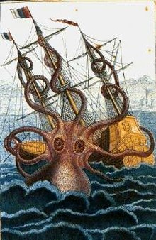

#######
KRAKEN
#######

Overview
========
The Kraken is a legendary sea monster of giant size that is said to dwell off the coasts of Norway and Greenland. A number of authors over the years have postulated that the legend originated from sightings of giant squids that may grow to 12–15 meters (40–50 feet) in length. In Sepulsa, Kraken act as Transaction service. Kraken have Tentacles Module which help it handling multiple concurrent transaction from partner.

Related
=======
.. csv-table::
  :header: "No", "System", "Desc"
  :widths: 10, 50, 100

   1, "John", "Test"
   2, "Aron", "Test2"
   
Team Involved
==============
.. note:: 
   This is note text. Use a note for information you want the user to
   pay particular attention to.
   
**************
Specifications
**************

Technology
==========
Platform Specification
-----------------------
